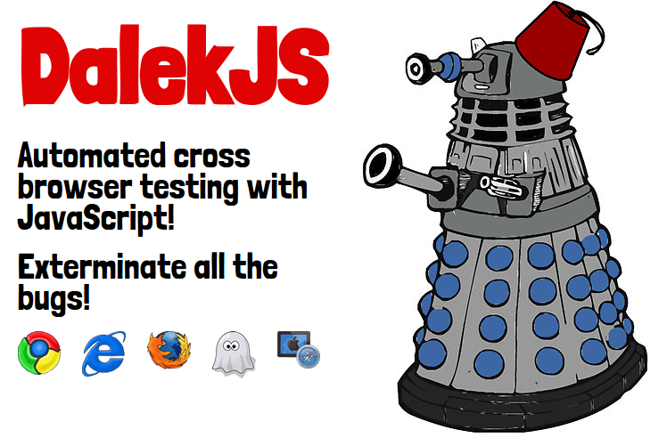

# DalekJS Playground

> Playing with E2E tests

<p align="center">
  
</p>

## Running

First of all, install [**NodeJS**](https://nodejs.org/). 

Then, install [**DalekJS**](http://dalekjs.com/) globally: 

```sh
[sudo] npm i -g dalek-cli
```

After that:

- Clone this repository;
- Access a project folder;
- Run `npm i`;
- Run `dalek index.js`.

Tests will be run with **PhantomJS**.

## Using real browsers

All projects has **Dalek Chrome Plugin** installed. To use it, run inside project directory:

```sh
dalek index.js -b chrome
```

To know all DalekJS options, [read the documentation](http://dalekjs.com/pages/documentation.html).

## License

[MIT](https://github.com/fdaciuk/licenses/blob/master/MIT-LICENSE.md) © Fernando Daciuk.
